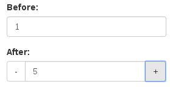

Very simple, fast and lightweight (> 3K) jquery plugin for bootstrap to render number input more user-friendly.

## Usage

```javascript
$(SELECTOR).bootstrapNumber({
	upClass: success/primary/danger/warning/default,
	downClass: success/primary/danger/warning/default,
	center: true/false
});
```

Checkout here for [demo](http://wpic.bitbucket.org/bootstrap-number-input/sample.html)
